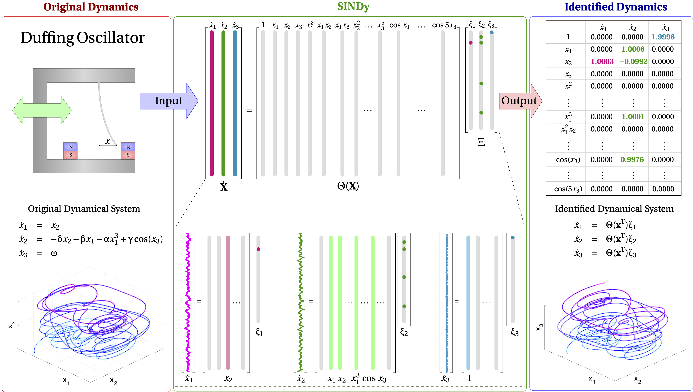

## modular Sparse Identification of Nonlinear Dynamics

**mSINDy - modular Sparse Identification of Nonlinear Dynamics** is a modular MATLAB framework for data-driven discovery of governing equations in nonlinear dynamical systems based on sparse regression and the Sparse Identification of Nonlinear Dynamics (SINDy) methodology.


<p align="center">

</p>

### Table of Contents
- [Overview](#overview)
- [Features](#features)
- [Usage](#usage)
- [Documentation](#documentation)
- [Authors](#authors)
- [Citing mSINDy](#citing-msindy)
- [License](#license)
- [Institutional support](#institutional-support)
- [Funding](#funding)
- [Contact](#contact)

### Overview
**mSINDy** was developed to support the identification, reconstruction, and interpretation of nonlinear dynamical systems directly from data, with emphasis on:
- Sparse Identification of Nonlinear Dynamics (SINDy)
- Sparse regression for equation discovery
- Data-driven identification of governing equations
- Reduced-order and interpretable dynamical modeling

The framework is designed to bridge theoretical concepts and practical computational workflows, including scenarios involving noisy measurements, nonlinear oscillations, chaotic dynamics, and limited observational data.

This repository accompanies the developments presented in:
- *A. Cunha Jr, and C. A. Lampe.*, Data-driven Evolution Equations via Sparse Identification of Nonlinear Dynamics. In: *Scientific Machine Learning for Predictive Modeling: Bridging Data-Driven and Physics-Based Approaches in Computational Science and Engineering*, edited by A. Cunha Jr, F. P. Santos, F. A. Rochinha, and A. L. G. A. Coutinho, Springer, 2026.

### Features
- Sparse identification of governing equations from trajectory data
- Polynomial, trigonometric, exponential, and logarithmic candidate libraries
- Sequential Thresholded Least Squares (STLS) sparse regression
- Sparse coefficient selection and model interpretation
- Reconstruction and prediction of nonlinear dynamics
- Validation using unseen initial conditions
- Handling of noisy datasets and derivative estimation
- MATLAB implementations for pedagogical and research applications
- Reproducible workflows aligned with published studies

### Usage
To get started with **mSINDy**, follow these steps:
1. Clone the repository:
   ```bash
   git clone https://github.com/americocunhajr/mSINDy.git
   ```
2. Navigate to the package directory:
   ```bash
   cd mSINDy/mSINDy-1.0
   ```
3. Run the mSINDy tutorials provided in the corresponding folders

The code includes the following examples:
- Linear harmonic oscillator
- Duffing oscillator
- van der Pol oscillator
- Rossler chaotic system
- Noise sensitivity and weak-form sparse identification

### Documentation
The routines in **mSINDy** are well-commented to explain their functionality. Each routine includes a description of its purpose, along with its inputs and outputs. Detailed documentation can be found within the code comments.

### Authors
- Americo Cunha Jr
- Cesar Augusto Lampe

### Citing mSINDy
If you use **mSINDy** in your research, please cite the following publication:
- *A. Cunha Jr, and C. A. Lampe.*, Data-driven Evolution Equations via Sparse Identification of Nonlinear Dynamics. In: *Scientific Machine Learning for Predictive Modeling: Bridging Data-Driven and Physics-Based Approaches in Computational Science and Engineering*, edited by A. Cunha Jr, F. P. Santos, F. A. Rochinha, and A. L. G. A. Coutinho, Springer, 2026.

```
@incollection{mSINDy2026,
  author    = {A. Cunha Jr and C. A. Lampe},
  title     = {Data-driven Evolution Equations via Sparse Identification of Nonlinear Dynamics},
  booktitle = {Scientific Machine Learning for Predictive Modeling: Bridging Data-Driven and Physics-Based Approaches in Computational Science and Engineering},
  editor    = {Americo Cunha Jr and F. P. Santos and F. A. Rochinha and A. L. G . A. Coutinho},
  publisher = {Springer},
  year      = {2026},
  address   = {Cham},
  url       = {https://sindycode.org},
}
```

### License

**mSINDy** is released under the MIT license. See the LICENSE file for details. All new contributions must be made under the MIT license.

 

### Institutional support

 &nbsp; &nbsp;  &nbsp; &nbsp; 

### Funding

 &nbsp; &nbsp;  &nbsp; &nbsp; 

### Contact
For any questions or further information, please contact the third author at:

- Americo Cunha Jr: americo@lncc.br
